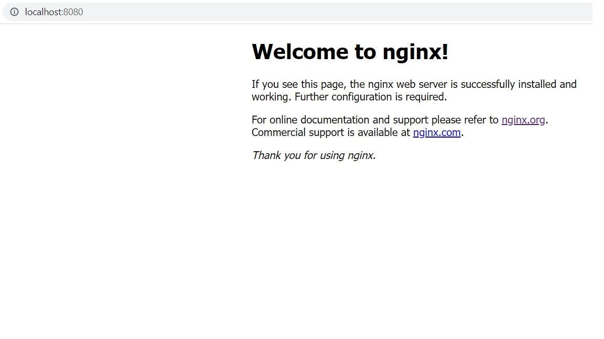

# Day 01: Deploy Nginx using docker run command

In the first day of docker series, we will see how we can deploy the nginx official docker image using docker run command.

Nginx is one of the popular web servers in the wold. Not only it is popular because of web server, most of them are using it as a reverse proxy server infornt of API and web applications.

Here is the syntax for the docker run command,

    docker run [OPTIONS] IMAGE [COMMAND] [ARG...]

Basically, docker run command first *creates* a writable container over the specified image and then *starts* the container. i.e., docker run = create + start

    # docker run --name nginx_webserver --publish 8080:80 --detach nginx:1.21
    Unable to find image 'nginx:1.21' locally
    latest: Pulling from library/nginx
    c229119241af: Pull complete
    2215908dc0a2: Pull complete
    08c3cb2073f1: Pull complete
    18f38162c0ce: Pull complete
    10e2168f148a: Pull complete
    c4ffe9532b5f: Pull complete
    Digest: sha256:2275af0f20d71b293916f1958f8497f987b8d8fd8113df54635f2a5915002bf1
    Status: Downloaded newer image for nginx:1.21
    ffb30a0fbd2bcc40422982a384ae358cd3ec8f8198079c2e95d20ecfcb1aa2c1

Brief about the above docker run command,

    --name              Assign a name to the container
    --publish or -p		Publish container's specific port(s) to the docker host. By default, if no ports are published, the process running in the container is accessible only inside the container. The above command binds containers port 80 to the host port 8080. If no host_ip and protocol is specified, it defaults to 0.0.0.0 and  TCP respectively
    --detach or -d		Run container in background and print container ID. 

The above command downloads the nginx docker image of version 1.21 from the docker registry if it is not available in the local system. Then it starts the container.

We can see the running container using docker ps command

    # docker run --name nginx_webserver --publish 8080:80 --detach nginx:1.21
    c3c2bb5cebd53bbfb9cffdd6a513bfbc7c71b46ffa2de3730ab99646a9b4c2e8

    # docker ps
    CONTAINER ID   IMAGE        COMMAND                  CREATED          STATUS          PORTS                  NAMES
    c3c2bb5cebd5   nginx:1.21   "/docker-entrypoint.…"   26 minutes ago   Up 26 minutes   0.0.0.0:8080->80/tcp   nginx_webserver

Now we can see the default page from nginx container by visiting *localhost:8080* in your browser

Thats the end of our first post. Keep Learning!
