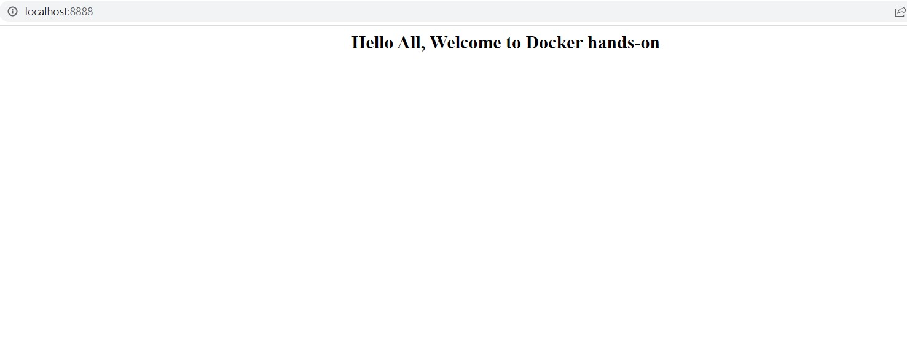

# Day 02: Deploy a HTML page with the help of dockerfile

In the second day of docker handson series, we will see how to deploy a HTML page.

**Flow: Base image or parent image -> customise the image using dockerfile(add the HTML page) -> Run the container**

Base images are images that have no parent image, usually images with an Operating System like ubuntu, centos or debian. To know about base image and parent image, check here https://docs.docker.com/develop/develop-images/baseimages/

## Prepare a Dockerfile

**Dockerfile** is a text document that contains all the commands that a user could call on the command line to assemble an image. With the help of dockerfile, we can create a docker image. Let's see how we are going to create an image to deploy a HTML page.

In this example, our base image is alpine version of nginx

    # Dockerfile
    FROM nginx:alpine
    COPY . /usr/share/nginx/html

## Create a docker image from dockerfile using docker build command

**Docker build** command executes the instruction present in the dockerfile and then creates a docker image.

    Syntax: docker build [OPTIONS] PATH | URL | -
    
    Actual command: docker build -t webserver:v1 .

The above command creates a docker image named webserver with a tag of v1. You may notice . (dot) at the end of the docker build command which tells that the dockerfile is present in the current directory.
    
Let's execute the **docker build** command and see the results.

    # docker build -t webserver:v1 .
    [+] Building 19.0s (8/8) FINISHED
    => [internal] load build definition from Dockerfile                                                                                                                   0.1s
    => => transferring dockerfile: 94B                                                                                                                                    0.0s
    => [internal] load .dockerignore                                                                                                                                      0.0s
    => => transferring context: 2B                                                                                                                                        0.0s
    => [internal] load metadata for docker.io/library/nginx:alpine                                                                                                       11.5s
    => [auth] library/nginx:pull token for registry-1.docker.io                                                                                                           0.0s
    => [internal] load build context                                                                                                                                      0.0s
    => => transferring context: 89B                                                                                                                                       0.0s
    => [1/2] FROM docker.io/library/nginx:alpine@sha256:5a0df7fb7c8c03e4158ae9974bfbd6a15da2bdfdeded4fb694367ec812325d31                                                  7.2s
    => => resolve docker.io/library/nginx:alpine@sha256:5a0df7fb7c8c03e4158ae9974bfbd6a15da2bdfdeded4fb694367ec812325d31                                                  0.0s
    => => sha256:df9b9388f04ad6279a7410b85cedfdcb2208c0a003da7ab5613af71079148139 2.81MB / 2.81MB                                                                         5.8s
    => => sha256:efc09388b15fb423c402f0b8b28ca70c7fd20fe31f8d7531ae1896bbb4944999 1.57kB / 1.57kB                                                                         0.0s
    => => sha256:51696c87e77e4ff7a53af9be837f35d4eacdb47b4ca83ba5fd5e4b5101d98502 8.89kB / 8.89kB                                                                         0.0s
    => => sha256:4b639e65cb3ba47e77db93f93c6625a62ba1b9eec99160b254db380115ae009d 600B / 600B                                                                             0.9s
    => => sha256:5a0df7fb7c8c03e4158ae9974bfbd6a15da2bdfdeded4fb694367ec812325d31 1.65kB / 1.65kB                                                                         0.0s
    => => sha256:5867cba5fcbd3ae827c5801e76d20e7dc91cbb626ac5c871ec6c4d04eb818b16 7.34MB / 7.34MB                                                                         5.9s
    => => sha256:061ed9e2b9762825b9869a899a696ce8b56e7e0ec1e1892b980969bf7bcda56a 894B / 894B                                                                             3.9s
    => => sha256:bc19f3e8eeb1bb75268787f8689edec9a42deda5cdecdf2f95b3c6df8eb57a48 666B / 666B                                                                             4.3s
    => => sha256:4071be97c256d6f5ab0e05ebdebcfec3d0779a5e199ad0d71a5fccba4b3e2ce4 1.39kB / 1.39kB                                                                         4.8s
    => => extracting sha256:df9b9388f04ad6279a7410b85cedfdcb2208c0a003da7ab5613af71079148139                                                                              0.2s
    => => extracting sha256:5867cba5fcbd3ae827c5801e76d20e7dc91cbb626ac5c871ec6c4d04eb818b16                                                                              0.5s
    => => extracting sha256:4b639e65cb3ba47e77db93f93c6625a62ba1b9eec99160b254db380115ae009d                                                                              0.0s
    => => extracting sha256:061ed9e2b9762825b9869a899a696ce8b56e7e0ec1e1892b980969bf7bcda56a                                                                              0.0s
    => => extracting sha256:bc19f3e8eeb1bb75268787f8689edec9a42deda5cdecdf2f95b3c6df8eb57a48                                                                              0.0s
    => => extracting sha256:4071be97c256d6f5ab0e05ebdebcfec3d0779a5e199ad0d71a5fccba4b3e2ce4                                                                              0.0s
    => [2/2] COPY index.html /usr/share/nginx/html/                                                                                                                       0.2s
    => exporting to image                                                                                                                                                 0.1s
    => => exporting layers                                                                                                                                                0.0s
    => => writing image sha256:9d17f94a0f426fd33e72742427102f317f0fbec4df83d3fd0ff7b69b67710a30                                                                           0.0s
    => => naming to docker.io/library/webserver:v1                                                                                                                        0.0s

Image has been created successfully. Let's check if it is availale in the local system or not.

    # docker images
    REPOSITORY                                                                   TAG                                                     IMAGE ID       CREATED         SIZE

    nginx                                                                        1.21                                                    12766a6745ee   10 days ago     142MB

## Deploy the newly created docker image

Now we have created the image which is ready to deploy. Let's see how we are going to deploy it.

    # docker run --name webapp --publish 8888:80 --detach webserver:v1
    25774a59230205b7248bd685f229af541ec99fd562b28a0291d5289a8efae242

Like we did it in the previous post, we used docker run command to deploy the image. By executing the docker run command, we can check the state of the container
    
    # docker ps
    CONTAINER ID   IMAGE          COMMAND                  CREATED              STATUS              PORTS                  NAMES
    25774a592302   webserver:v1   "/docker-entrypoint.…"   About a minute ago   Up About a minute   0.0.0.0:8888->80/tcp   webapp

Now we can see our HTML page by visiting **localhost:8888** in the browser.

Yeah! We did it. That's the end of Day two.
