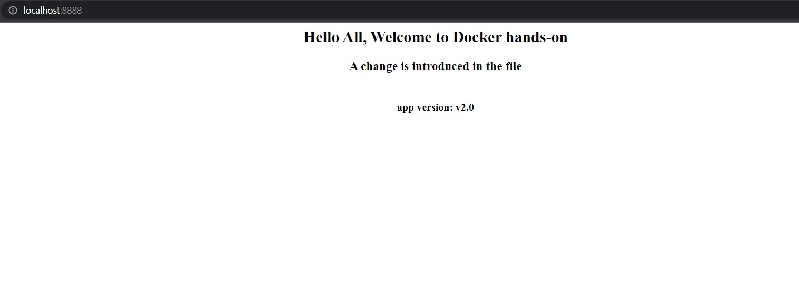

# Day 04: Update the source code and deploy the latest version of docker image

Assume we need to do some update in our application and need to deploy the same. Let's see how we are going to perform the update on our existing webserver docker image.

## Update the source code

In the existing index.html file from Day02 post, we are adding the following lines,

    <h3>
 A change is introduced in the file
></h3>
    <h4>
app version: v2.0
></h4>

## Release a new version of docker image

Once the index.hmtl is updated, the next step is to build the docker image using docker build command. So that we will get the new version of docker image with the updated code.

    # docker build -t webserver:v2 .

    Sending build context to Docker daemon  3.072kB
    Step 1/2 : FROM nginx:alpine
    ---> 51696c87e77e
    Step 2/2 : COPY index.html /usr/share/nginx/html/
    ---> db75d484a41a
    Successfully built db75d484a41a
    Successfully tagged webserver:v2

Execute the command *docker images* to confirm that the webserver:v2 image is created

    # docker images
    REPOSITORY         TAG       IMAGE ID       CREATED         SIZE
    webserver          v2        db75d484a41a   3 minutes ago   23.4MB

## Tag the updated docker image

Tag the image using the following command,

    # docker tag webserver:v2 xxxx/webserver:v2

List the images to see whether the image is properly tagged or not

    # docker images
    REPOSITORY          TAG      IMAGE ID       CREATED          SIZE
    xxxx/webserver      v2       db75d484a41a   23 minutes ago   23.4MB    

## Push the updated docker image to dockerhub

It's time to push the tagged image to dockerhub

    # docker push xxxx/webserver:v2

    The push refers to repository [docker.io/xxxx/webserver]
    df440896c4ad: Pushed
    b991c80c3ef2: Layer already exists
    8df6b63c60d4: Layer already exists
    d63b53686463: Layer already exists
    c0b09410617a: Layer already exists
    be9057e6dae4: Layer already exists
    4fc242d58285: Layer already exists
    v2: digest: sha256:a397cae53024aff6f7a720af3387de07b4737dc12fcb6a8c2b2c8e4803dc1e68 size: 1775

## Deploy the updated image

Let's run the container with the updated docker image

    # docker run --name webserver_v2 --publish 8888:80 --detach xxxx/webserver:v2
    57eebcb02698bef084248938ba6037af66f6a29d0e3cfcb0a3c9a67c7e3dba85

Since the image is avilable locally, it doesn't downloads from the dockerhub. Otherwise, the image will be downloaded from the dockerhub.

Check the container is running or not

    # docker ps
    CONTAINER ID  IMAGE             COMMAND                 CREATED        STATUS       PORTS                  NAMES
    57eebcb02698  xxxx/webserver:v2 "/docker-entrypoint.…"  7 minutes ago  Up 7 minutes 0.0.0.0:8888->80/tcp webserver_v2

Visit the *localhost:8888* in your browser and see the updated version of the application.

