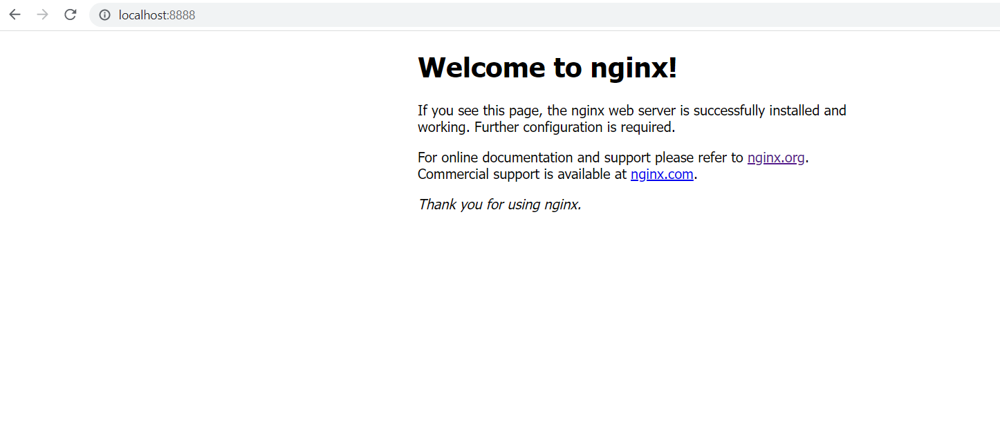

# Day 09: Write the dockerfile and run the container

Today, we will see the dockerfile instructions and then create a docker image by writing dockerfile

## Understand Dockerfile instructions

Here is the list of dockerfile instructions with small descriptions,

- FROM baseImage:tag - BaseImage to use for subsequent instructions.

- LABEL key=value - Adds metadata to an image

- WORKDIR Set the working directory for any instructions that follow it in the Dockerfile.

- RUN command -  Execute any commands on top of the current image as a new layer and commit the results.

- COPY source destination - Copy files or folders from the source to the dest path in the image's filesystem.

- ADD Copy files, folders, or remote URLs from the source to the dest path in the image's filesystem.

- VOLUME Create a mount point with the specified name and mark it as holding externally mounted volumes from the native host or other containers.

- ENTRYPOINT ["executable", "param1", "param2"] (or) ENTRYPOINT command param1 param2 - Configures the container to be run as an executable.

- CMD Provide defaults for an executing container. If an executable is not specified, then ENTRYPOINT must be specified as well. There can only be one CMD instruction in a Dockerfile.

- EXPOSE PORT - Network ports that this container will listen on at runtime.

## Let's write the dockerfile

In the previous blog post, to run the Nginx container, we directly downloaded the Nginx Docker image from the docker hub and ran it. However, here we are going to download the ubuntu docker image where we are going to perform Nginx installation. This is purely for learning purposes. To run the Nginx container, directly downloading the Nginx docker image is the preferred way to do.

First, let's download the base image,

    FROM ubuntu:22.04

If you want to enter some meta tags using LABEL,

    LABEL maintainer="navinprasadk"

Then, install the Nginx package using apt package manager in the ubuntu docker image,

    RUN apt-get update && \
        apt-get install -y nginx

Here the command inside the ENTRYPOINT instruction tells Nginx to stay in the foreground, thus the container keeps running. Otherwise, Nginx will exit and the docker container stops.

    ENTRYPOINT [“/usr/sbin/nginx”,”-g”,”daemon off;”]

Now, exposing the port 80. We can use port 80 for inter-container communication.

    EXPOSE 80

Here. we combine all the instructions of dockerfile,

    FROM ubuntu:22.04
    LABEL maintainer="navinprasadk"
    RUN apt-get update && \
        apt-get install -y nginx
    ENTRYPOINT ["/usr/sbin/nginx","-g","daemon off;"]
    EXPOSE 80

## Build the docker image

    # docker build -t nginx:v1 .

    Sending build context to Docker daemon  2.048kB
    Step 1/5 : FROM ubuntu:22.04
    ---> 3f4714ee068a
    Step 2/5 : LABEL maintainer="navinprasadk"
    ---> Using cache
    ---> 255dad0b1805
    Step 3/5 : RUN apt-get update &&     apt-get install -y nginx
    ---> Using cache
    ---> 3a6a4ec8cd8c
    Step 4/5 : ENTRYPOINT [“/usr/sbin/nginx”,”-g”,”daemon off;”]
    ---> Running in 2527a9c13dea
    Removing intermediate container 2527a9c13dea
    ---> c5ee6d94b2b5
    Step 5/5 : EXPOSE 80
    ---> Running in b13db2c79686
    Removing intermediate container b13db2c79686
    ---> 6ed8ee2855c2
    Successfully built 6ed8ee2855c2
    Successfully tagged nginx:v1

Successfully built the docker image with the tag of v1. Let's run the container with the help of the newly created docker image.

    # docker run --detach --name nginx_con --publish 8888:80 nginx:v1
    d0f965e7206ebb67cfc086bcaec31a130738109cc90a06410847835b78eed4bc

Let's check the running container,

    # docker ps    
    CONTAINER ID   IMAGE      COMMAND                  CREATED         STATUS         PORTS                  NAMES
    d0f965e7206e   nginx:v1   "/usr/sbin/nginx -g …"   3 minutes ago   Up 3 minutes   0.0.0.0:8888->80/tcp   nginx_con

It looks container is running. Now, visit the localhost:8888 in your browser and see the result.

Cool! Nginx container is up and running.
