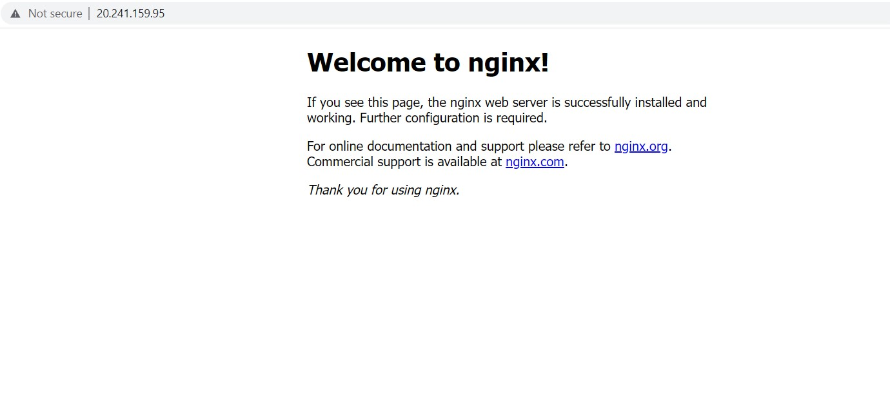

# Day 18: Deploy a container in Azure Container Instances [Cloud]

So far, we have used docker for windows as a place to practise all the topics. In this post, will see how to deploy the container in the Azure Cloud.

## Azure Container Instances (ACI)

On Azure, there are many services available to deploy the container. Out of that, one preferred tool to deploy containers would be [Azure Container Instances (ACI)](https://azure.microsoft.com/en-us/services/container-instances/). With ACI, you can create and manage Docker containers, without having to set up a Virtual Machine or manage additional infrastructure.

## Azure Cloud Subscription - Free Trial

I have created an [Azure free trial subscription](https://azure.microsoft.com/en-us/free/) to perform this task. Once you are done with the Azure subscription setup, we can easily start with our process.

## Create Azure Context

1.Azure Context associates Docker with an Azure subscription and resource group so you can create and manage container instances. Before creating Azure context, log in with your Azure account.

    # docker login
    login succeeded

When prompted, enter the azure credentials to log in.

2.Create an Azure context

Create a new Azure context by using the "docker context create aci <name of the context>" command

When prompted, select your Azure subscription ID, then select an existing resource group or create a new resource group.  

Here is the output after executing the above command,

    # docker context create aci my-docker-context
    Using only available subscription : Free Trial (d86dc8b1-7fbb-4c43-9d0a-b6b7ce412db0)
    ? Select a resource group create a new resource group
    Resource group "7120bc5e-7cc4-a419-da46-e3feccfbc8bd" (eastus) created
    Successfully created aci context "my-docker-context"

3.List the context

List the available context by entering the docker context ls command,

    # docker context ls
    NAME                TYPE                DESCRIPTION                                   DOCKER ENDPOINT                             KUBERNETES ENDPOINT                                            
    my-docker-context   aci                 7120bc5e-7cc4-a419-da46-e3feccfbc8bd@eastus  

4.Use the context

Use the newly created context by executing the below command. Hereafter, all the Docker commands run in this context

    # docker context use my-docker-context
    my-docker-context

## Deploy the container

Now, you can deploy a container in ACI. Execute the following docker run command to perform this action.

    # docker run --name nginx-web --publish 80:80 --detach nginx:1.21
    [+] Running 2/2
    - Group nginx-web Created                                 10.7s
    - nginx-web       Created                                 31.8s
    nginx-web

The container named "nginx-web" has been successfully created. Run the docker ps command to view the running container, it also lists the public address.

    # docker ps
    CONTAINER ID        IMAGE               COMMAND             STATUS              PORTS
    nginx-web           nginx:1.21                              Running             20.241.159.95:80->80/tcp

Now go to the 20.241.159.95:80 in the browser, and you will see the Nginx default home page.

Finally, do not forget to delete the resources from the Azure cloud.