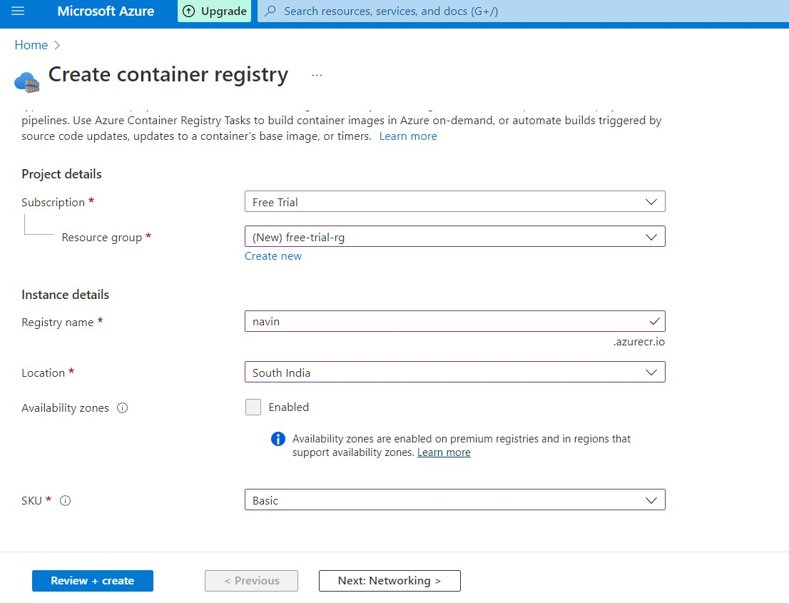
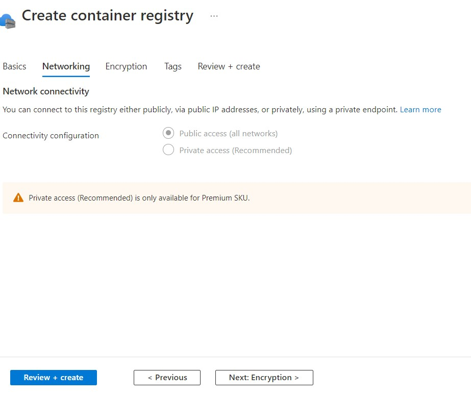
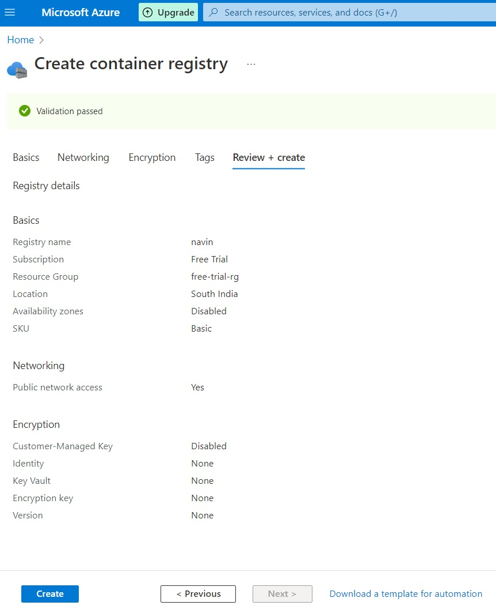
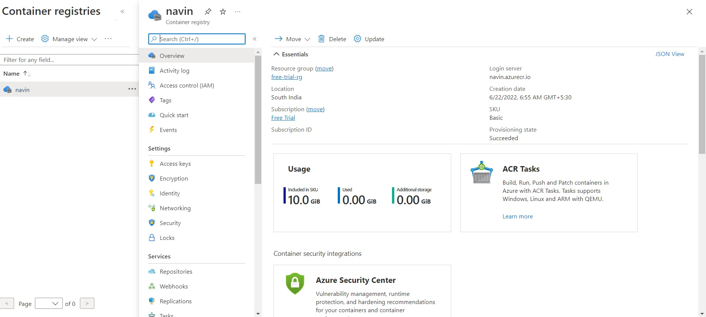
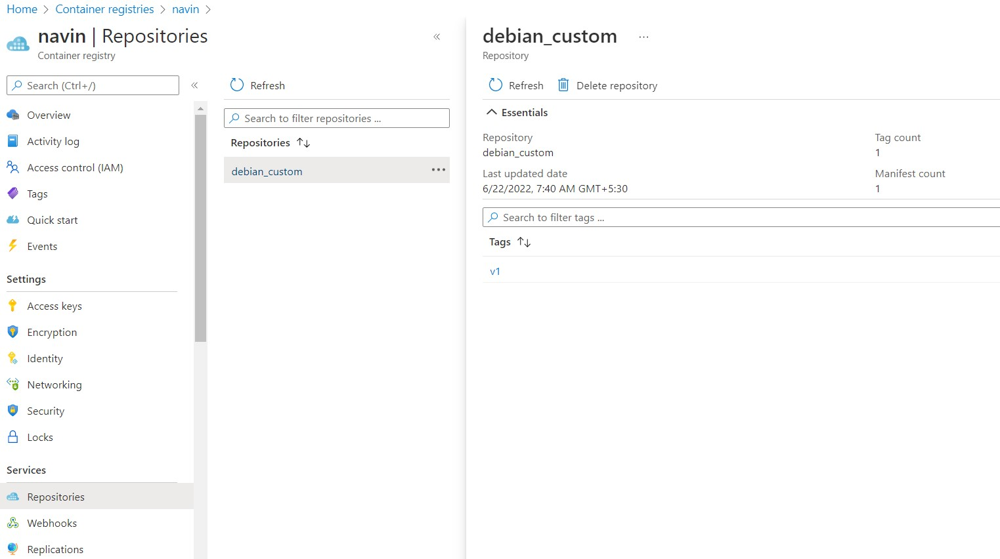

# Day 19: Create a container registry in Azure Container Registry (ACR)

In the [Day 03: Push the docker image to the container registry](./../Day03/README.md) post, we have uploaded the docker image to the docker central repository. In this today's post, we are going to create a container registry in the Azure cloud where we are going to push the images. Azure Container Registry (ACR) is a private registry service for building, storing and managing récipient images and related artifacts

## Azure Cloud Subscription - Free Trial

I have created an [Azure free trial subscription](https://azure.microsoft.com/en-us/free/) to perform this task. Once you are done with the Azure subscription setup, we can easily start with our process.

## Create an ACR

In the Azure portal, go to  **Container registries**, and select create button. In the basics tab, enter values for Resource group, Registry name, Location and SKU.  

Skip the Networking and Encryption as it is not available for Basic SKU.  

Finally, select Review in the Review + Create tab.  

Once the deployment succeeds, you can see the registry details which include the login server name. Here the login server name is navin.azurecr.io.  

## Login with the Azure Container registry

Let's login to your container registry. You can get the login URI and credentials from Access keys blade.

    docker login navin.azurecr.io
    Authenticating with existing credentials...
    Login Succeeded

## Build the image

To push an image to the ACR, we need an image to upload. Let's build it.

Create the  image by building the dockerfile which I have kept in [src](./src/) directory

    docker build -t debian_custom:v1 .

Once the build is succeeded, then go to the next step.

## Tag and Push the image to the ACR

The next step is to tag the image using the docker tag command.

    # docker tag debian_custom:v1 navin.azurecr.io/debian_custom:v1

    # docker push navin.azurecr.io/debian_custom:v1
    The push refers to repository [navin.azurecr.io/debian_custom]
    017832398cdf: Pushed
    0ad3ddf4a4ce: Pushed
    v1: digest: sha256:a31fb14e60aecaa847788a0a47a5681cd965722be4b7681e0c3d22f650d68dbd size: 736

## List the images in ACR

To view the pushed images in the ACR, go to the Azure portal and select **Container Registries -> navin -> Repository** and view it.

  