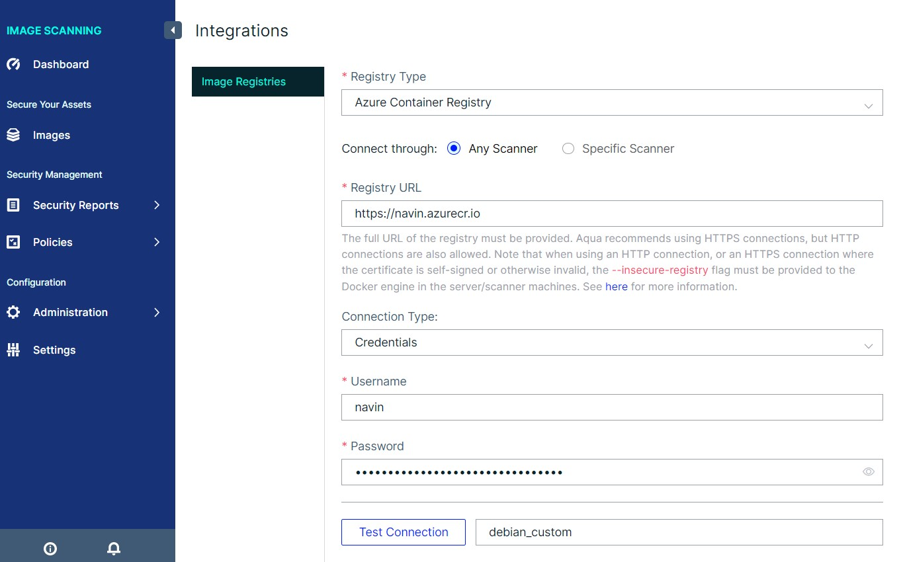
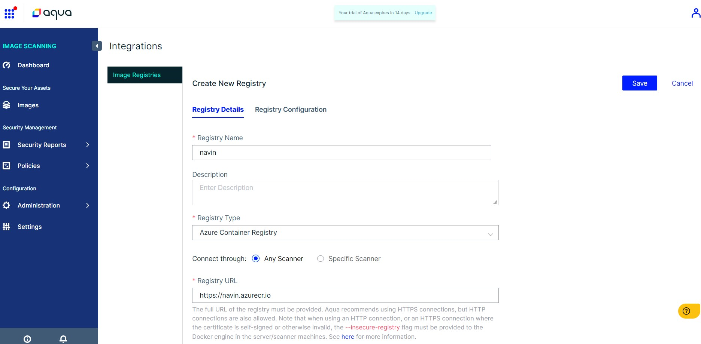
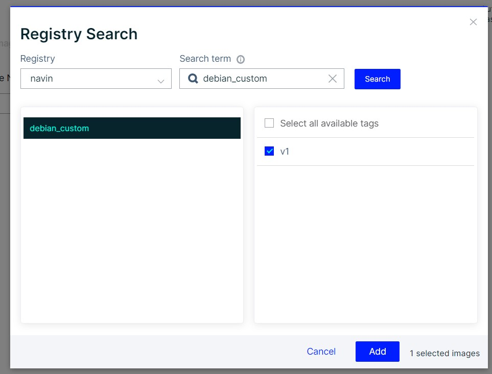
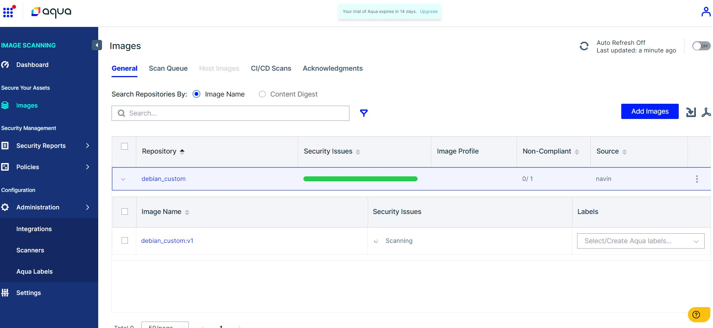
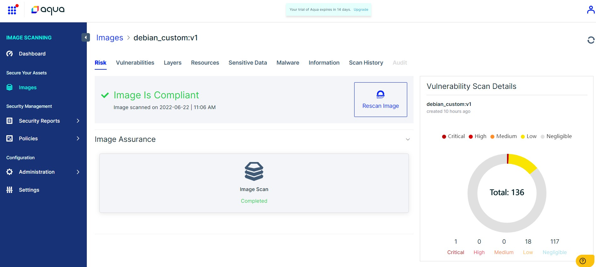
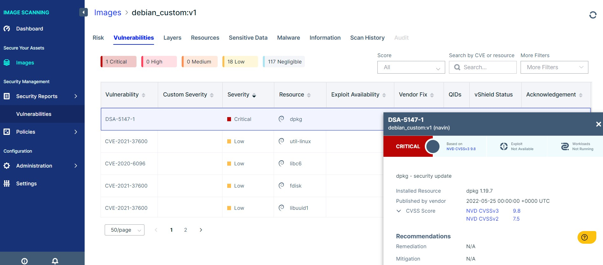
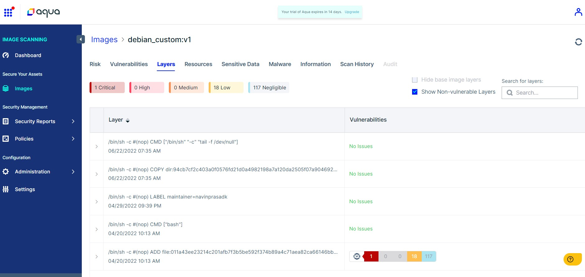

# Day 20: Scan the Container image in the ACR using Aqua

## Container Image scanning

Container image scanning typically involves checking the vulnerabilities present in the Container layers and checking the sensitive information by analysing the dockerfile. It helps to validate the security state of the container images and take actions to fix the issue identified during the scan. Thereby, we can achieve the secure deployment of the container. Some container image registries provide built-in image scanning tools. In Azure Container Registry, Microsoft defender for cloud is available to perform Container Image Scanning.

## Container Image scanning by Aqua

In this post, we will see how to perform container image scanning using Aqua. According to Aqua's official documentation, Aqua image canning includes:

**Vulnerability Scanning (VS)** scans your container images to detect known CVEs and other security issues during the development cycle. It allows you to gain insights into your vulnerability posture and prioritize remediation and mitigation according to contextual risk. This capability uses the market-leading open source scanner Trivy and its comprehensive vulnerability tracking across both OS packages and language-specific dependencies.

**Dynamic Threat Analysis (DTA),** the industry’s first container sandbox solution, complements Vulnerability Scanning to detect unknown and evasive threats. It dynamically assesses the risks of container images before they run in your production environment. DTA runs your container images in an isolated environment (sandbox) that monitors behavioral patterns and detects multiple Indicators Of Compromise (IOCs) such as container escapes, malware, crypto miners, code injection backdoors, network anomalies, and more. DTA also classifies detected behaviors into categories of the MITRE framework.

## Create Aqua free trial account

Let's create a free trial account with [Aqua](https://cloud.aquasec.com/) which is free for 14 days. No credit cards are required to open the account.

## Integrate Aqua with Azure Container Registry

Once you are done with the registration process with aqua, log in with your credentials. On the homepage of Aqua, select **Integrations** in the left pane and select **Azure ACR** under the registries section, it will open the new page and ask for registry details.

As displayed in the below screenshot, enter the Azure container registry name and registry link with the protocol (HTTP or HTTPS)  

<!--  -->

Once all the details are entered, you can save the configuration.

## Add an image to perform the Image scanning

The registry is successfully added in the previous steps. Now, it is time to add the image to perform the scan. Select **Add Image** and then dialogue box appears where you have to select the registry 'navin' from the **Registry** drop-down list and enter the image name in the **search_term** and then select **search**. Finally, Select the image and version from the list. Then, click **Add** to add the image for scanning.  

Here, you can see the status of image scanning.  

## View Scan Results

Once the scanning is done, Aqua displays the vulnerability scan details under the corresponding container image.

The below screenshot shows the scanned container image is compliant. Under the vulnerability details, it lists the number of critical, medium and high vulnerabilities.  

Under the vulnerability tab, Aqua lists the vulnerability present in the container image with the CVSS score. CVSS scores provide a numerical (0-10) representation of the severity of an information security vulnerability.  

You can see the vulnerabilities present in each container layer by visiting the **Layers** tab. Aqua assess the risk of a container layer before reusing it in other images by identifying the vulnerability in one of its components, exposing the specific layer of the image and speeding up remediation by either updating the vulnerable package or rolling back the image to a previous version.

